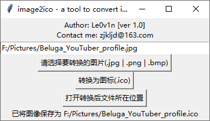

[README_EN](https://github.com/Le0v1n/image2ico/blob/4623f5ebdb7010a14993f47a9e3519a61296a821/README_EN.md)

# 🥰生成ICO文件工具

这是一个简单的工具，用于将图像文件转换为 `.ico` 文件的GUI应用程序。

## 1. :rocket:功能特点

- 选择输入图像文件。
- 转换图像文件为 `.ico` 文件。
- 自定义 `.ico` 文件的保存位置和名称。
- 查看转换后 `.ico` 文件所在文件夹。

## 2. 👀使用方法

1. 下载并运行可执行文件：[Download Here](https://github.com/Le0v1n/image2ico/releases/tag/ver1.0)

2. 选择要转换的图像文件。

3. 点击“转换为图标(.ico)”按钮。

4. 自定义 `.ico` 文件的保存位置和名称。

5. 如果需要，点击“打开文件所在位置”按钮查看转换后的 `.ico` 文件。

## 3. 🐱‍🐉技术要求

- Windows 操作系统
- Python 3.x

## 4. 🐱‍👤安装依赖

这个可执行文件已包含所有所需的依赖项，无需额外安装 Python 或其他库。

## 5. ✨示例



## 6. 🎁自行生成

```bash
pyinstaller --onefile --noconsole --icon icon.ico --name image2ico-ver-1.0 --add-binary "C:\Users\Le0v1n\.conda\envs\gui\lib\site-packages\PIL;Pillow" image2ico.py
```

## 7. :warning:Note

360 安全卫士可能会报毒，添加信任即可。如果不放心，可自行检查代码或自行生成 `.exe` 程序。


## 8. :e-mail:Contact me

Welcome to contact me if there are any bugs.

+ [Contact me](mailto:zjkljd@163.com)
